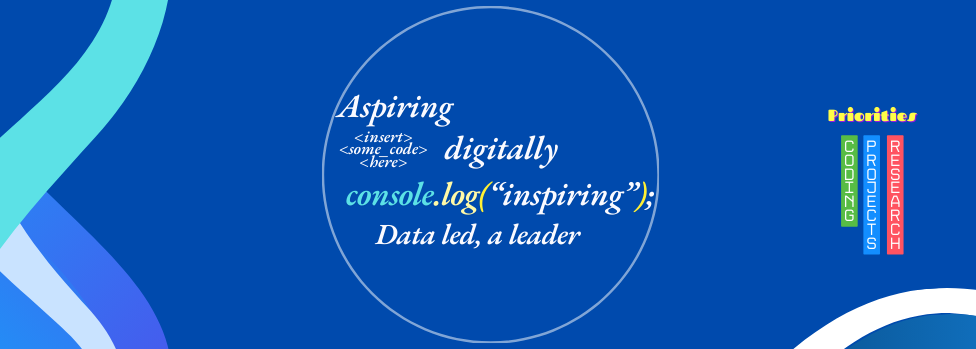

###

  
  

####

<h2 align="left">Hello👋! Thanks for landing on my profile</h2>

## About Me
I am a project management professional with several years spanning civil society organisations.
- *I am currently working as Project Officer and on some coding projects.*
- *In my free time, I do coding, research, and generate social content.*
- *I wish to learn more of programming and establish a career in the Tech industry.*

## Qualifications
- *Public Health for Eye Care*
- *Entrepreneurship Management*
- *Economics*

## Certifications
- *PRINCE2 v7*
- *MS Projects MasterClass*
- *Scrum Master*

## Projects
- *Interactive Periodic Table of Elements*
- *Built an interactive professional CV. [Link](T03 – CSS - Overview/index.html)*

## Statistics

  <kbd></kbd>

###

## Languages

  
  <kbd></kbd>
  <kbd></kbd>
  <kbd></kbd>
  <kbd></kbd>
  <kbd></kbd>
  <kbd></kbd>
  <kbd></kbd>
  <kbd></kbd>
  

## Social Media

  
  <kbd></kbd>
  <kbd></kbd>
  <kbd></kbd>
  

## Publications

  <kbd></kbd>

